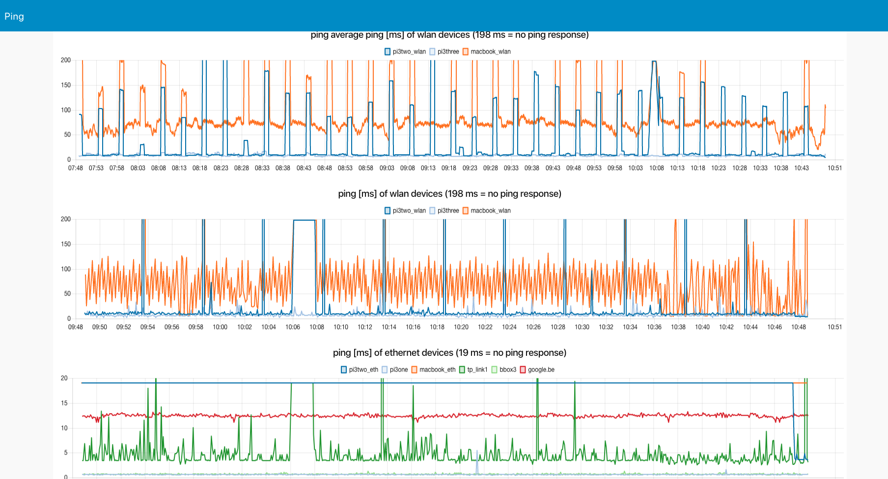
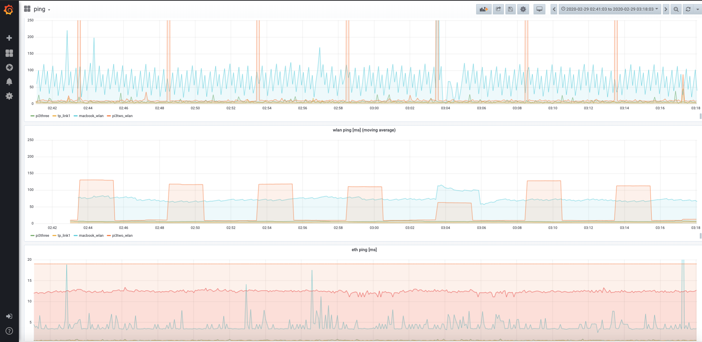

ping
====

This flows measures every 5 sec the ping times of several hosts and shows it in charts in the ping tab of the node-red UI dashboard.

Moreover the ping times are also stored in an influx database which can be visualized in a graphana dashboard.

## screenshot node-red dashboard

## screenshot example graphana dashboard

